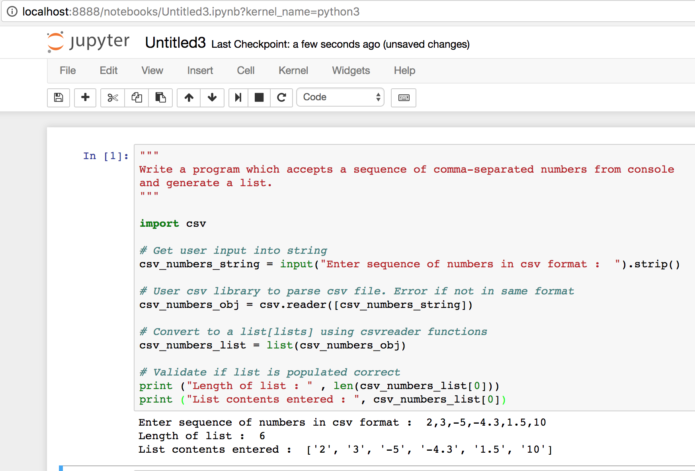
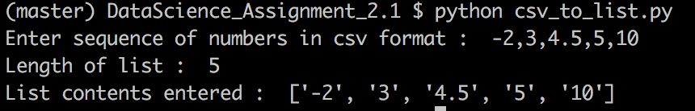

# Problem Statement :
```
Write a program which accepts a sequence of comma-separated numbers from console
and generate a list.
```

## Snapshot - Run from jupyter REPL 
```
import csv_to_list.ipynb in jupyter REPL 
```




## Snapshot - Run from command line bash
```
Command to execute : python csv_to_list.py
```


